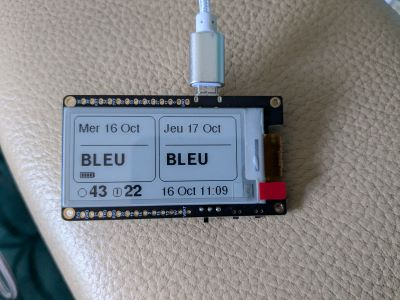

# Affichage des couleurs des jours EDF TEMPO sur Lilygo T5 (ESP32)

## 📝 Description Générale

Ce dépôt contient le code source pour un dispositif qui affiche les informations relatives au tarif TEMPO d'EDF sur un écran E-Ink, en utilisant un microcontrôleur ESP32. Le dispositif récupère les données TEMPO en temps réel via une API et affiche la couleur du jour et du lendemain. 
Ce projet était initialement basé sur https://github.com/kaloskagatos/EDF-Tempo-E-Ink-Display. 
Je ne maintenais plus la branche pour Arduino IDE aussi j'ai supprimé mon fork et recréé ce projet. 
Nouveauté 2024 : les API EDF ne répondent plus. Migration du projet vers les API RTE (https://data.rte-france.com/) 
Nouveauté Bis : après être passé sur les API RTE avec inscription, il y a maintenant une autre API RTE sans inscription.
Il est désormais possible d'utiliser l'une ou l'autre.
 

## 🌐 Connexion WiFi

Pour la configuration du réseau WiFi vous devez renseigner les variables wifi_ssid et wifi_key dans le fichier TOCUSTOMIZE.h avec vos informations.

## 🌐 API RTE

Si vous voulez utiliser les API sans inscription, dans le fichier TOCUSTOMIZE.h, en ligne 6, dans la variable tempoSansCompteTRE il faut mettre la valeur true.
Si vous voulez utiliser les API avec inscritpion (probablement plus durables), mettez la valeur false.

Pour utiliser les API RTE vous devez vous créer un compte ici : https://data.rte-france.com/create_account 
Ensuite, il faut vous abonner à l'api : https://data.rte-france.com/catalog/-/api/consumption/Tempo-Like-Supply-Contract/v1.1 
Puis créer une application de type MOBILE
Vous aurez alors accès à vos client id et client secrets qu'il faudra renseigner dans le fichier TOCUSTOMIZE.h

## ⏰ Heures de Réveil Préprogrammées

Le dispositif est programmé pour se réveiller à 2h00, 6h30 et 11h05

## 🖥️ Matériel Utilisé

- **Board ESP-32 E-Ink**: T5 V2.3.1 - Écran E-Paper 2.13 pouces à faible consommation d'énergie, modèle GDEM0213B74 CH9102F [Q300]
  - [Lien vers le produit](https://www.lilygo.cc/products/t5-v2-3-1) 
    ❗Attention, la version 2.3.2 (vendue sur Aliexpress et probablement ailleurs) n'a pas de puce série embarquée. Voir discussion [Issue 2](https://github.com/LArtisanDuDev/Lilygo_T5_EDF_Tempo/issues/2) 
    ❗Il faut (à confirmer suivant retour de l'utilisateur dans l'issue) un adaptateur supplémentaire pour sa programmation : [t-u2t](https://lilygo.cc/products/t-u2t).
      

## Librairies externes utilisées 

* https://github.com/bblanchon/ArduinoJson
* https://github.com/ZinggJM/GxEPD
* https://github.com/LArtisanDuDev/MyDumbWifi
* https://github.com/LArtisanDuDev/TempoLikeSupplyContractAPI

## 📄 Licence

Ce projet est distribué sous la licence GNU General Public License v3.0. Pour plus de détails, veuillez consulter le fichier `LICENSE` dans ce dépôt.

---

## Contribution

Les contributions à ce projet sont les bienvenues. Si vous souhaitez contribuer, veuillez suivre les directives de contribution standards pour les projets GitHub.

## Support et Contact

Pour le support ou pour entrer en contact, veuillez ouvrir un ticket dans la section issues du dépôt GitHub.

## Bugs connus

* Not yet 😉
